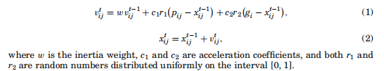
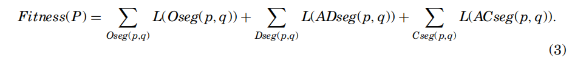
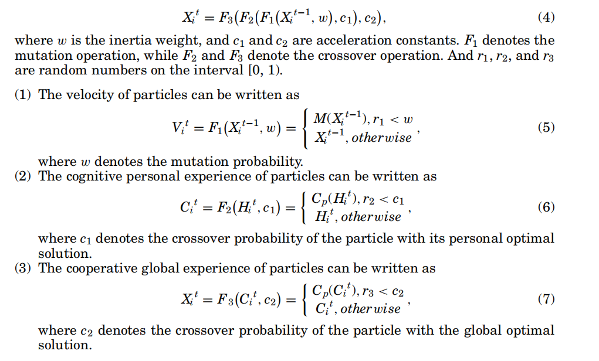
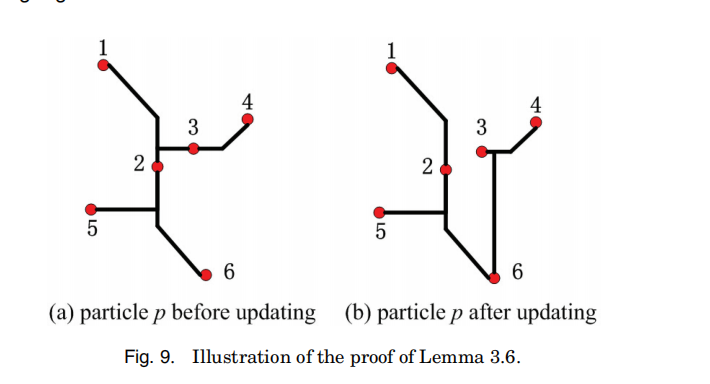
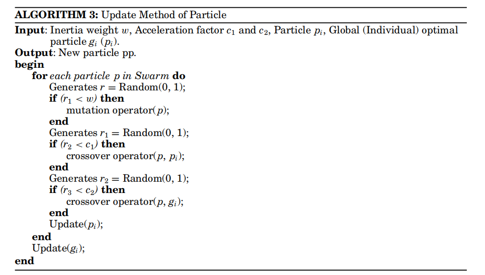
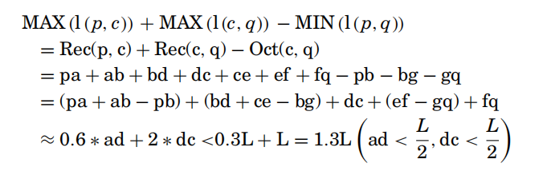
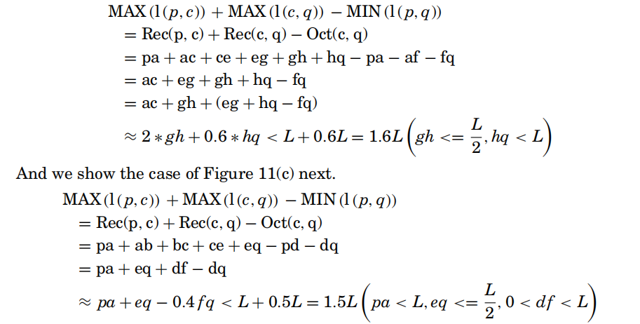
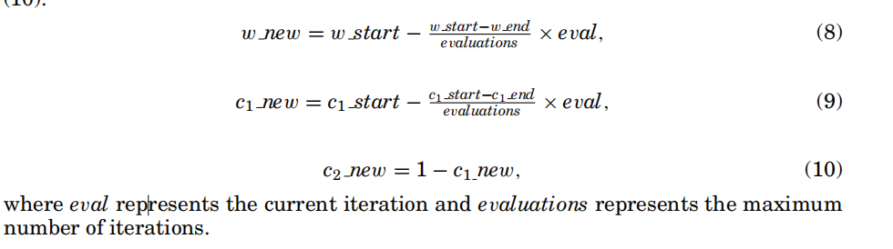

# 基于离散粒子群优化的x体系结构中的障碍规避算法

## 摘要

避障Steiner最小树构造已经成为现代超大规模集成电路(VLSI)芯片物理设计中的一个焦点问题。本文提出了一种基于X-architecture ex的OASMT构造算法。首先，提出了一种特殊的粒子群优化算法，该算法成功地结合了经典的遗传算法，大大提高了自身的搜索能力。其次，提出了一种处理障碍物和大头针的预处理策略，通过生成预先计算好的查找表为整个算法提供快速的信息查询。第三，我们提出了一种有效的调整方法，通过引入障碍物的角点，使得粒子能够避开所有的障碍物。最后讨论了一种优秀的精炼方法，进一步提升了最终布线树的质量，平均可提高解的质量7.93%。据我们所知，这是第一次专门解决X架构中的单层避障问题。实验结果表明，该算法能够在有障碍物的情况下进一步缩短布线长度。在现有算法中，它在合理的运行时间内获得了最佳的解质量。

## 1.介绍

超大规模集成电路中的布线一直是研究人员非常关心的问题。这是VLSI物理设计过程中最重要的步骤之一。另一方面，随着集成电路(IC)技术的进步，现代VLSI设计已经转向片上系统范式，芯片密度大大增加，物理设计过程中出现越来越多的障碍，如ip块、宏单元和预布线网络。在布线时，考虑障碍尤为重要，然而，目前该领域的大多数工作都集中在曼哈顿体系结构上[Hanan 1966]，并且许多人提出用启发式思想来构造直线Steiner最小树(RSMT)。问题是作为精确算法[黄和杨2011，2010；李等[2009]基于曼哈顿架构提出，研究人员只有优化运行速度才有空间。对于最关键的问题之一，即线长，这些启发式方法只能艰难地做出新的贡献。由于非曼哈顿架构[Koh and Madden 2000]包含45°̘、60°̘、120°̘、135°̘布线方向，因此对于减少布线长度非常重要[Chen et al. 2003]。因此，一个优秀的非曼哈顿算法变得迫切。

对于曼哈顿建筑，当忽略障碍物的存在时，研究了许多高效和有效的方法[Chu 2004；甘利和科恩1996年；何等1989；Chu和Wong，2008年]。例如，Chu和Wong [2008]提出了一种快速准确的RSMT算法，称为FLUTE，它基于预先计算的查找表。FLUTE的结果对于低度网是最佳的，并且通过使用破网技术对于高度网也是非常精确的。在考虑障碍的时候，近年来已经有很多优秀的方法给出。黄和Young [2010]提出了一种几何方法来解决复杂障碍物中的避障直线Steiner最小树(OARSMT)问题，该方法既能处理凸形障碍物，又能处理凹形障碍物，并能获得最优解。在文献[Chow et al. 2014]中，借助图形处理单元(GPU)实现了并行算法，这是第一个提出并行方法来构建OARSMT的工作。Liu等人[2012]提出了Steiner点位置的新概念，并创建了具有满意Steiner点候选的线性空间布线图，以解决大多数现有启发式算法的瓶颈。刘等[2012]与当时已有算法中的最好结果[黄和杨2010]相比，运行速度更快，但线长减少了1.67%。此外，Shen等人[2005]使用一个只包含O(n)个边和顶点的生成图来构造OARSMT。Long等人[2008]设计了一种高效的四步算法来构造OARSMT，在各种基准上的实验结果表明，该算法平均实现了16.56倍的加速比，而平均线长仅比当时给出的现有最佳解大0.46%。

随着生产技术的进步，学术界和工业界的大部分注意力都集中在λ-几何上，尤其是λ= 4(X-体系结构)。文献[Chiang和Chiang 2002]中的实验结果表明，对于2端网络，八线形(Xarchitecture)布线线路长度比直线布线短17%。对于东芝微处理器，Teig [2002]应用了一种基于X的技术，将过孔数量、总线路长度和芯片尺寸分别减少了40%、20%和11%。然而，现有的大多数基于X架构的工作都假设了一个无障碍的布线平面。例如，Kahng等人[2003]提出了一种基于三重收缩的近优RSMT算法，该算法可以很容易地修改以构建八线性Steiner最小树(OSMT ),并且运行时间增加很少。朱等[2005]提出了两种基于八线生成图的构造算法:一种是边替换算法，运行速度快，效果好；另一种是三角形收缩算法，运行时间增加很小，但性能更好。此外，在文献[Coulston 2003]中提出了精确的算法，并介绍了多种剪枝技术来构建OSMT。对于避障八线性Steiner最小树(OAOSMT)构造问题，据我们所知，Jing等人[2007]是迄今为止解决单层线长优化的唯一相关工作，然而，它是为解决λ-几何而设计的，而不是专门针对X-体系结构。在文献[Jing et al. 2007]中，所提出的算法基于约束Delaunay三角剖分，其中构造全连通避障树，然后通过区域组合嵌入到λ- OASMT中。随着λ的改变，将获得不同的布线架构。此外，在文献[Yan 2008]中提出了一种基于变换的方法来构造时序驱动的八线性Steiner树，该方法在时序延迟方面获得了10%-18%的改进，在总线路长度方面获得了5%-14%的改进。

PSO作为一种基于群的智能方法，由埃伯哈特和肯尼迪[1995]引入，并被证明是一种全局优化算法。PSO算法具有收敛速度快、全局搜索能力、稳定、高效等诸多优点。大量的实践已经证明，与其他方法相比，PSO算法可以得到一个更便宜的最优解。

在上述分析的基础上，为了在x体系结构布线和避障问题上做出更突出的贡献，我们设计了一种基于x体系结构的解决OASMT问题的综合方法。我们的主要贡献有三方面，并总结如下。

-据我们所知，这是第一个专门解决单层X基OASMT问题的工作。我们的方法在合理的运行时间内达到了以往算法中最好的解决方案质量。此外，它还可以提供一组实验数据，以便与后续的工作进行比较。

在PSO算法中集成了两种新的基于联合集的算子，进一步提高搜索能力，使粒子实现更最优的线长。

将预处理策略、自调整方法、精炼方法等启发式算法与PSO算法相结合，可以提高整个算法的性能。据我们所知，这也是第一次结合启发式策略和群体智能算法来解决OASMT问题。

本文的其余部分组织如下：在第2节中，我们将给出基于x的OASMT问题的数学模型、一些基本定义和基本的PSO算法。在第3节中，我们将详细描述所提出的算法。第4节给出了实验结果，第5节总结了我们的工作。

## 2.问题的公式化和方法模型

### 2.1.问题模型

定义2.1（障碍）。在OASMT问题中，一个障碍物可以被定义为任何大小的矩形，除了边界部分之外，任何两个障碍物都不能重叠。

定义2.2（布线架构）。在二维λ几何中，对于所有i，只允许有角度为iπ/λ的方向，并且λ是一个整数（λ > 2）。

（1）直线结构。当λ的值设置为2时，布线方向为iπ/2，其中包括0◦和90◦。

（2）正线性(X)体系结构。当λ的值设置为4时，布线方向变为iπ/4，其中包括0◦、45◦、90◦和135◦。

定义2.3（伪斯坦纳标准）。为方便起见，我们假设除引脚引点外的端点统称为伪斯坦纳点。

问题模型。基于X的OASMT问题的数学模型可以简化如下:设P = {P1，P2，P3...Pn}是网络中的一组引脚，其中每个Pi都被分配了其坐标(，yi)。让B = {B1，B2，B3...Bm}是芯片上的一组障碍物，其中每个Bi与两个坐标(Xi1，Yi1)和(Xi2，Yi2)相关联。(Xi1，Yi1)和(Xi2，Yi2)分别是矩形障碍物的左下角和右上角的坐标。那么关键问题就是构造一个Steiner树，用0♀，45♀，90♀，135♀线连接所有给定的管脚，同时以最小的代价避开所有给定的障碍。应当注意，该树可以包括一些伪Steiner点。

引脚和障碍物的输入信息分别列于表一和表二中。图1显示了该布局。例如，可以看到销1位于（230,114），障碍物1位于（449,150）和（672,303）。

定义2.4（选择0）。在图2(a)中，设P=(X1、Y1)和Q=(X3、Y3)为线段L的两个端点，其中X1<X3。图2(b).给出了与边L对应的伪斯坦纳点的选择0它首先将直线侧从P引向伪斯坦纳点S，然后将非直线侧引向Q。

定义2.5（选择1）。与边L对应的伪斯坦纳点的选择1如图2(c).所示它首先将非直线侧从P引向伪斯坦纳点S，然后将直线侧引向Q。

定义2.6（选择2）。与边L对应的伪斯坦纳点的选择2如图2(d).所示它首先引导垂直侧从P到伪斯坦纳点S，然后引导水平侧到Q。

定义2.7（选择3）。边L对应的伪Steiner点的选择3如图2(e)所示。它首先引导水平侧从P到伪斯坦纳点S，然后引导垂直侧到Q。

定义2.8（直角连接模型）。在布线模型中，如果一个引脚可以通过转动不超过一次来连接到另一个，并且布线选择仅限于选择2或选择3，我们称之为引用连接模型。如图3(a)所示，引脚p可以在布线区域通过一次选择3与引脚q连接。

定义2.9（X结构连接模型）。在布线模型中，如果一个引脚可以通过转动不超过一次来连接到另一个，并且布线选择仅限于选择0或选择1，我们称之为oct连接模型。如图3(b)所示，引脚p可以在布线区域通过一个时间选择1与引脚q连接。

定义2.11（断开连接的模型）。障碍的存在可能会抑制某些点被选择为伪斯坦纳点。如图3(c)所示，如果一个针可以通过至少转动两次或更多次来连接到另一个针，那么它将形成一个断开连接的模型。

在下面的章节中，我们假设两个引脚之间的所有边都由两个段组成，如图2(b)-(e)所示。

### 2.2.基本PSO

PSO算法是一种基于种群的人工智能算法。我们考虑一个包含N个粒子的总体S。每个粒子都有一个D连续的空间，并有它自己的速度和位置。粒子i的当前位置可以表示为xi=(xi1，xi2……xiD)，粒子i的当前速度可以表示为vi=(vi1，vi2……viD)。我们将种群S的全局最优粒子标记为gi，记录粒子i的最佳历史位置并表示为pi=(pi1，pi2……piD)。粒子的速度和位置的更新公式可以表示为

## 3.算法的细节

在本节中，我们提出了一个有效的OAOSMT构造算法。它包括以下五个步骤。

（1）初始化。在这一步中，粒子种群被有效地生成，其中每个粒子都是一个跨越所有给定引脚的OSMT。

（2）预处理。在此步骤中，生成一个包含任意两个引脚的所有连接信息的表，以为后续步骤提供快速的信息查询。

（3）飞行。在这一步中，通过引入两种新的遗传算法联合集算子来更新每个粒子的速度和位置。

（4）调整。在这一步中，如果有必要，调整总体的最终全局最优粒子gf，以确保所有边避免所有障碍。

（5）精炼。在这一步中，我们应用一种精炼的方法来进一步提高最终的全局最优粒子gf的质量。此外，还采用了一种后处理方法来确保gf适用于当前的制造技术。

### 3.1.初始化

在本文中，我们给出了每个销和障碍的一个唯一的序列号。然后，我们使用一组最小生成树边来表示一个候选布线树，并向每条边添加一个额外的变量来表示伪斯坦纳点的布线选择，然后将其转换为一个八线性斯坦纳树。每个伪steiner的布线选择包括四种类型，如定义2.4-2.7所示。如果网络中有n个引脚，最小生成树将包括n个−1条边，n个−1个伪斯坦纳点，以及一个额外的变量，即粒子的适应度值（第3.3.3节）。所以一个粒子的长度是3∗(n−1)+1。例如，如图4所示，粒子可以表示为以下数字字符串：1 3 2 2 3 0 3 4 1 3 5 3 27.3，其中23.7表示粒子的适应度值。第一串1 3 2表示根据选择2来连接的包括销1和销3的一条边。

由于步骤（1）是基于最小生成树(MST)算法，我们可以通过一些基于图的方法，如Prim算法或Kruskal算法，或更有效的基于三角的算法，更容易地得到八线性MST。需要注意的是，每条边的初始布线方向都是从四个给定的布线选择中随机选择的，因此可能会穿过障碍。

### 3.2.预处理

根据PSO算法的基本模型（第2.2节），在初始化粒子种群后，每个粒子将通过更新其速度和位置进行移动，整个种群将相互协作，搜索所需的目标。但是，在介绍我们的粒子更新方法之前，我们首先描述了一个预处理策略，主要是由于以下三个问题。

首先，在粒子飞行步骤中，当评估一个在运动后产生的粒子时，除了计算每条边的长度外，还应该检查每条边是否避开了所有的障碍。然后对每个粒子给出适当的适应度值，算法可以选择正确的全局最优粒子gi和个人最优粒子pi（第3.3.3节）。

其次，在操作调整方法之前，必须确定最终的全局最优粒子gf的每条边是否避免了所有的障碍物。即，应决定是否有必要进行调整。如有必要，应调整哪些边缘，并通过了哪些障碍？所有这些信息均应进行计算（第3.4节）。

第三，在操作精炼的过程中，我们不断地改变一些边的布线方向，以尽可能地提高共享边的长度。但是，我们如何确保转换后的边缘避免所有的障碍呢？该信息也需要计算（第3.5节）。

由于现代芯片密度的急剧增加，这个问题的规模比以往任何时候都要大。如果算法每次都计算之前提到的信息，这无疑会对整个算法的性能产生负面影响。因此，我们提出了一种预处理策略，通过生成一个预先计算的查找表，可以为步骤（3）-步骤（5）提供快速的信息查询。

预处理策略的思想简单且易于实现。设p = {p1，p2，p3...pn}是网络中的一组引脚，b = {b1，b2，b3...bm}芯片上的一组障碍物。对于每对pin，例如pi和pj，我们预先计算边pi pj (c)穿过的障碍物的数量，并将所有这些障碍物的记录作为集合{Bk}，其中c表示pi和pj之间的布线选择。所有这些可能边的记录将构成最终的查找表。图5显示了原理。网络中有五个引脚(1-5)，芯片上有六个障碍物(B1-B6)。以引脚1为例，图5(a)显示了基于选项2和选项3的引脚1与其它引脚的连接图，而图5(b)包括选项0和选项1。可以看出，一些线段穿过障碍物，而另一些则没有。根据图5，可以很容易地生成pin 1的记录。如表III所示，很容易查询关于引脚1的所有连接信息。例如，基于选择1，当引脚1连接到引脚4时，边穿过障碍物b3和障碍物b4。然而，当针1基于选择2连接到针3时，边缘避开所有障碍。

表四显示了在具有2.9ghzCPU和2GB内存的PC中的查找表生成时间。引脚#和Obs#分别表示引脚和障碍物的数量。我们可以使用一个k维(KD)树来组织障碍的所有角点(k为我们的问题的=2)。在计算边缘pipj的记录时，我们只需要从KD树中找到那些满足至少有一个角点位于pipj的矩形边界框中的障碍物。因为查找表只需要为每一组布线数据生成一次，所以我们在实现实验时只使用了一个传统的数据结构，比如一个数组。当生成一条边的记录时，我们扫描每个障碍bk一次，如果bk的角点不位于两个针的矩形边界框中，那么我们直接检查下一个障碍bk+1。此外，45个◦片段和135个◦片段的存在无疑会增加问题的复杂性。当输入的规模很大时，这可能需要几秒钟，但这是可以接受的。

### 3.3.飞行的

利用PSO算法的初始原型来求解连续优化问题。但自从PSO算法被提出以来，越来越多的研究者试图使用PSO来解决离散问题。例如，Clerc[2004]提出了一种离散的解决旅行推销员问题的离散PSO算法。在本节中，我们介绍了两个新的基于联合集的算子来解决OAOSMT构造问题。

#### 3.3.1.突变操作

突变操作从生成树中随机删除一条边，然后用另一条随机生成的边替换它，以确保生成树是连接的。我们使用并集-查找集，在删除一条边后，将所有的点记录为两个集，并分别从两个点集中随机选择一个点。然后，我们将两个选定的点连接起来，形成一个新的生成树。其原理如图6所示，为了简单起见，我们使用了一条直线，而不是一条八边线。红线表示要移除的边，虚线表示新的边。算法1显示了突变操作的伪代码。突变操作的详细步骤如下。

（1）从生成树中随机选择一条边，并将其删除。（2）扫描其余的边，并使用联合集将所有点划分为两个点集。（3）随机选择两个点p1和p2。（4）检查点p1和点p2是否在同一集合中，如果是，则返回到（3）。（5）将点p1与点p2连接，以形成新边。

#### 3.3.2.交叉操作。

如第3.1节所述，每个引脚都有一个唯一的序列号。在进行交叉操作时，我们根据两个生成树的小到大的顺序对所有边缘进行排序。然后，我们使用联合查找集从两个排序的树中选择相同的边作为一个集合，其余不同的边作为另一个集合。第一组边被直接用作新的生成树边。然后，我们从第二个集中随机选择一条边，并将其添加到新的生成树中，直到生成一个完整的树，同时使用联合集防止生成圆。其原理如图7所示，其中红线表示两个生成树之间的不同边，虚线表示新生成树的新边。算法2显示了交叉操作的伪代码。交叉操作的具体步骤如下。

（1）根据第一个引脚的序列号对每个父节点中的所有边进行排序，如果是匹配的，则根据第二个引脚的序列号进行排序。

（2）扫描这两个已排序的边缘集。选择与新生成树的边相同的边。同时，将所有其他边复制到另一个集合。

（3）随机从S中选择一条边，添加到新的生成树中，直到形成一个完整的树。使用联合查找集来防止一个圆在同时形成。

#### 3.3.3.一个粒子的适应度函数

在PSO算法的基本模型中，适应度函数是最重要的组成部分之一。适应度函数的准确性与选择pi和gi的正确性直接相关。由于我们的优化目标是宽的，很明显，使用OSMT的总长度作为一个粒子的适应度值是一个很好的选择；它可以直接反映一个粒子的卓越程度。实际上，在我们定义的OSMT模型中，有三种边，可以定义如下。给定一个布线树t和两个引脚p和q，那么我们有以下内容。

定义3.1（Oseg（p、q））。Oseg(p，q)表示p和q之间的一条边，它不通过路径平面中的任何障碍物。

定义3.2（Dseg（p、q））。Dseg(p，q)表示p和q之间的一条边，它穿过一个或多个障碍，只能通过改变p和q之间的布线选择来避免它们。

定义3.3（Cseg（p、q））。Cseg(p，q)表示p和q之间的一条边，它穿过一个或多个障碍，但必须从这些障碍中选择一些角点，以避免它们。

实际上，Cseg(p，q)是一个不连通的模型，而Oseg(p，q)和Dseg(p，q)可能属于三种连接模型中的任何一个。如图8(a)所示，A和B之间的边属于Oseg(A，B)，A和D之间的边属于Dseg(A，D)，因为只有通过将AD的布线选择从选择3改为选择1才能避免所有障碍(图8(b))。A和C之间的边属于Cseg(A，C)，因为必须选择障碍物的角点C1作为中间节点(图8(b))。需要注意的是，在AC1和CC1之间可能有其他的布线选择。

定义3.4（ADseg（p、q））。ADseg(p，q)表示p和q之间的一条边，这是在改变p和q之间的布线选择后得到的，它避免了所有的障碍。

定义3.5（ACseg（p、q））。ACseg(p，q)表示p和q之间的一组边，它是由Cseg(p，q)在添加一个或多个障碍的角点后得到的，并且避免了所有的障碍。

在图8(b)中，A和D之间的边属于ADseg(A，D)。此外，A和C之间的两条边(AC和CC1)都属于ACseg(A、C)。我们假设L(r)等于r的总长度。在上述定义的基础上，我们提出了我们的适应度函数如下：

在公式（3）中，Oseg(p、q)、Dseg(p、q)、ADseg(p、q)和Cseg(p、q)可以通过查找表很容易地识别。对于ACseg(p，q)，计算类似于调整过程（第3.4节），但只是计算L(ACseg(p，q))的结果，而不是实现实际的增减操作。

#### 3.3.4.粒子的更新方法

采用了一种新的基于遗传运算和联合集的离散位置更新方法。该粒子的更新公式表示为

引理3.6。假设Cp是粒子p的当前位置。Ap为根据公式（4）更新后的位置。Fp是p要寻找的目标，dis(t)表示位置t和FP之间的距离。然后就可能会有dis(Ap)>dis(Cp)。

证明。很明显，由于更新方法以随机模式运行，它可能会导致p的一些好的因素被一些意外的因素所取代。例如，如图9所示，当根据公式(5)更新p的速度（图9(a)）时，如果选择边缘2 3 2并被边缘3 6 3代替，将得到图9(b)。显然，说(b) >和(a)，在进行认知和合作时也是如此。

算法3显示了更新方法的伪代码。

### 3.4.调整

粒子飞行结束后，选择种群的最终全局最优粒子gf作为最终的八线布线树。粒子gf可能是如此的优秀，因为它可以直接避免了所有的障碍。当然，它也可能很糟糕，它遇到了许多障碍。对于后者，如第3.3.3节所述，当粒子的边缘pq穿过障碍物时，只有两种可能的情况： Dseg（p，q）和Cseg（p，q）。这两个方法都可以通过表查找直接识别，第一个也可以通过查找表进行调整。然而，第二种方法可能需要更多的技术支持，因此我们提出了这种调整方法。具体的步骤说明如下。

(1)对于gf的一个边pq，通过查找表来检查pq是否避免了所有的障碍。如果是，请重复此步骤以检查下一条边，直到它进入最后一条边。否则，请转至步骤(2)。

(2)通过查找表格来检查边缘pq的选项0和选项1。如果它们中的任何一个都可以避免所有的障碍，则将原来的布线选择替换为当前的布线选择。否则，请删除边pq，然后转到步骤(3)。

(3)通过查找表格列出pq通过的所有障碍物，并根据p与障碍物中心之间的距离按升序对这些障碍物进行排序。假设排序的列表是Bk = {Bk，1，Bk，2，... Bk，n}，当前起点s = p，当前障碍B = Bk，j，j = 1。

(4)从B中选择一个最接近直线平方线的角点c。计算sc的连接信息，并将此信息添加到查找表中。同时，根据选择0和选择1先于选择2和选择3的规范来连接sc。然后设置=c。如果j = n并转到步骤(5)。否则，用B = Bk，j+1重复此步骤。

(5)计算sq的连接信息，并将此信息添加到查找表中。然后根据选择0和选择1是首选的标准来连接sq。

在这种调整方法中，步骤(2)用于处理Dseg(p，q)，因为它只需要查表；图8已经显示了原理，这里不再详述。步骤(3)-步骤(5)用于求解Cseg(p，q)。图10(a)显示了pq的原始连接图，它穿过障碍物B1和B2。删除边pq后，根据p到B1和B2中心的距离，我们先考察B1。从图10(b)可以看出，c1是距离直线pq最近的角点，因此它被选为中间节点并连接到p。然后我们检查障碍物B2。在图10(c)中，c2连接到c1，因为它是距离直线c1q最近的角点。最后，在图10(d)中，c2连接到q。有三点需要注意。首先，新边的所有连接信息都应该添加到查找表中，因为这对精炼是有用的(3.5节)。第二，步骤(2)只检查选项0和选项1。即，即使选择2或选择3可以避开所有障碍，我们也不实现替换操作(引理3.9)。第三，我们采用一种策略，在步骤(4)和步骤(5)中选择0和选择1是首选。虽然在某些情况下这可能会获得非最佳的结果，但由于精炼方法的作用，这并不重要。

在下面的章节中，我们假设Rec（p，q）表示在使用选择2或选择3时p和q之间的距离。Oct（p，q）表示使用选择0或选择1时的距离，而l（p，q）表示使用四个布线选择中的任何一个的距离。

引理3.7。假设销p和销q之间的一条边形成一个不连通的模型，并且该边pq穿过一个障碍b。为了避免b，将b的一个角点作为中间节点，最多可增加线长1.3L-1.6L，其中L为b的边长。

证明。假设MAX (a)和MIN (a)分别是a的最大值和最小值。不失一般性，我们假设p在障碍物下方，靠近b的左下角，q在障碍物上方，pq形成一个不连通的模型。图11(a)显示了q在p的左边的情况，因此根据调整方法可以选择b的左下角和左上角作为中间节点。因为Rec（p，c）+ Rec（c，q）对于两个角点都是相同的，所以我们只给出了第一个角点的证明。另一种情况是q在p的右边，因此可以选择b的左下角和右上角作为中间节点。图11(b)和图11(c)分别显示了连接图。对于图11(a)，我们有以下内容。

对于图11(b)，我们有以下内容。

因此，增加的线长为1.3L–1.6L，其中L为障碍物b一侧的长度。对于p和q位置不同的情况，我们可以使用类似的证明，因此在这里省略。

引理3.8。如果点c是点p和点q的中间节点，那么Rec（p，q）的矩形边界框中= Rec（p，c）+ Rec（c，q）如果c位于p和q。如果c位于由p和q形成的平行四边形中，则Oct（p，q）= Oct（p，c）+ Oct（c，q）。

证明。根据p、c、q组成的段间的平行关系，很容易得到方程。因此，我们不解释更多。

引理3.9。当引脚p和引脚q之间的一条边形成一个网格连接模型，并穿过障碍物b时，添加一个角点c作为中间节点，与只改变pq的布线选择相比，可以得到一个宽的缩减。

证明。如图12(a)所示，pq贯穿b，由于边pq形成了一个recconnected模型，我们可以通过将pq的布线选择从选择0替换为选择2来避开b。然而，如图12(b)所示，如果我们选择点c作为中间节点，我们将得到Oct(p，c) <= Rec(p，c)，Oct(c，q) <= Rec(c，q)，因此当且仅当p，c和c，q分别共线时，等式成立。根据引理3.8，由于c位于pq的矩形包围盒中，则Rec(p，c) + Rec(c，q) = Rec(p，q)。因此我们得到Oct(p，c) + Oct(q，c) <= Rec(p，q)。请注意，在最坏的情况下，pc和cq形成一个rec连接模型，因此线长减少为零。

定理3.10。使用调整方法可以增加线长或可以减少线长。

证明。如引理3.7中所述，当存在一个断开连接的模型时，线长可以增加1.3L-1.6L。然而，当存在一个网格连接模型时，在引理3.9中，我们证明了与边缘直接避免障碍物的情况相比，线长也可以减少。此外，对于oct连接和全连接的模型，如果存在一条边穿过障碍物，调整方法将选择选择0或选择1来代替原来的布线选择。它是p和q之间的最短路径。这一策略对减少无线具有重要意义。

### 3.5.精炼

引理3.6已经证明了一个粒子在更新位置后可能变得更差。事实上，粒子以随机模式飞行是粒子群算法具有如此强大搜索能力的主要原因之一。此外，在调整步骤期间，使用选择0和选择1是优选的规范并不总是有效的，因此所获得的结果可能仍然包括或多或少的非最优结构。例如，如图13所示(为简单起见，我们仅给出两个引脚之间水平距离大于垂直距离的示意图)，p是一个2度引脚，分别连接到引脚q和引脚g。有两条边，每条边有四种布线选择，因此将获得16个子结构，但只有一个是最优的。假设Hor(p，q)代表p和q之间的水平距离，在图13中，Hor(p，q) > Hor(p，g)，s是使用choice 0时pq的Steiner点。当g在p和s之间(包括边界)时，最优结构将是p q 0 p g 3。图14显示了g位于q和s之间的情况，在这种情况下，p和g之间的布线选择取决于实际增加的长度。即当ge + es < gd或es ed > 0时，将选择p g 3 (ii)，否则，将选择p g 0 (i)。此外，图15显示了一个4度模型，它可以分为两个2度模型。图15右侧的九个结构是最佳结构的候选。

在此分析的基础上，提出了一种基于边缘共享策略的面向针的精炼方法，该方法可以将所有非最优结构转化为最优结构，同时避免所有障碍。具体的步骤说明如下。

(1)扫描粒子gf的每条边，计算每个端子p的度，同时记录所有连接到p的所有端子。

(2)对于每个终端p，如果p的度为d，则枚举p的所有4d布线选择组合，选择最小适应度值最小同时避开所有障碍的组合。

在精炼过程中，有两点需要注意。首先，关于端子的组合是否避开所有障碍的问题可以通过查表直接确定，因为我们在调整过程中添加了必要的角点连接信息。第二，对于每个避障组合，为了给整个粒子选择最优的一个，我们可能需要计算gf的适应度值，而不仅仅是组合本身的长度。图16显示了一个冲突示例。计算引脚p的最佳组合时，将得到p q 0 p g 3。然而，当sq > sr + rt时，p q 3 f q 3将导致引脚q，因此我们需要从全局角度选择p q的布线选择。

算法4给出了该精炼方法的伪代码。度(p)用于计算销p的度，列表(p)用于记录所有与p连接的端子，替换（g，t）用组合t替换粒子g的相应部分，检查(t)通过表查找检查组合t的每个边是否避免了所有障碍。

实际上，如图17所示，这种精炼方法的粒子群在飞行步骤中不需要搜索所需的目标，因此提高了算法的效率。

### 3.6.考虑可制造性的后处理方法

此时，我们在对全局最优粒子进行精炼后，得到了一个优秀的基于x的OASMT。然而，需要注意的是，这个基于x的OASMT可能包括大约45个◦角。这些锐角由两个相交的边形成，例如，如图18(a)所示，两条边p g 0和p q 3形成一个角θ=45◦。考虑到工业生产的实际情况，需要去除这45个◦角，因此我们提出了一种简单的后处理方法。

通过分析锐角产生的原因和这些锐角的结构，我们把它们分为两种类型。第一个问题可以通过直接改变两条相交边中的一条边的布线选择来解决。以图18(a)为例，我们可以通过将边pg的布线选择从选择0更改为选择3来消除锐角。如图18(b)所示，我们得到了一个没有锐角的新布线结构。图18(c)显示了第二种锐角。这种锐角不是仅仅通过改变一条边的走线选择就能消除的，因为它可能会产生交叉或者新的锐角。因此，我们采用了通过删除一条边并生成一条新边来消除锐角的策略。如图18(d)所示，通过删除边p q 0，生成边p g 3，成功去除了45♀角。当然，我们也可以删除边g q 0并生成一个新的边g p 2来消除这个45°角(图18(e))。应该注意，在新生成的结构中，原始边的布线选择也可能改变，并且应该保证新的布线选择避开所有障碍。很明显，这个操作可以通过直接查找表来执行。例如，在图18(e)中，边pq的布线选择从选择0变为选择3。因为线长是我们的优化目标，所以我们的算法将选择线长最短的结构作为结果。根据精炼过程的度(p)和列表(p)的结果，可以快速识别所有相交的边。将这种后处理方法应用于最终的全局最优粒子gf后，可以有效地消除所有锐角。

算法5显示了后处理方法的伪代码。在算法5中，改变布线选择(l)用于改变边l的布线选择，并选择不产生任何锐角的一个，同时作为结果实现最短的布线长度。布线组合(l1，l2)用于计算边l1和l2的布线选择组合，并且在实现最短布线长度的同时不获得任何锐角。select(r1，r2)用于在r1和r2之间选择一个组合作为结果，并且该结果必须保证避开所有障碍并实现更短的线路长度。从算法5中可以看出，我们首先尝试通过使用第一种类型的方法，然后使用第二种类型的方法来移除锐角。注意，所有边的连接信息可以通过直接查找表来获得，因此该过程是高效的。

### 3.7.各参数的控制策略

属性，第3.9节。惯性权值的设置会影响一个粒子的局部和全局搜索能力之间的平衡。

从速度更新公式(1)中可以看出，第一部分提供了一个粒子在搜索空间中的飞行动力，并表示了前一个速度对飞行轨迹的影响。因此，惯性权值是一个表示这种影响程度的数值。

属性3.10。较大的惯性权重将保证该算法具有较强的全局搜索能力

公式(1)和性质3.9表明，惯性权重决定了将保留多少之前的速度。因此，一个较大的惯性权值可以增强对未到达区域的搜索能力，这有助于提高算法的全局搜索能力，并跳出局部极小值。惯性权重较小，说明该算法主要在当前解附近进行搜索，有利于提高局部搜索能力，加速收敛.

在文献[Shi和Eberhart 1998,1999]中，研究者提出了一种基于线性递减惯性权重的PSO算法。为了确保更强的全局搜索，他们在早期阶段使用较大的惯性权重，而在后期阶段使用较小的惯性权重来保证局部搜索。对四种不同基准函数的仿真结果表明，这种参数策略实际上提高了PSO算法的性能。

属性。3.11年。加速度系数越大c1，可能导致局部范围内的游移，加速度系数c2越大，会使算法过早收敛于局部最优解。

加速度系数c1和c2用于粒子之间的通信。Ratnaweera等人[2004]提出了一种策略，在早期使用啤酒c1和较小的c2，并在后期逆转。这样，该算法将保证在局部范围内进行详细的搜索，以避免在早期阶段直接移动到全局最优的位置，并在后期阶段加快收敛速度。同样，我们的实验也取得了很好的结果。

基于前面的分析，我们采用了一种动态策略，在早期阶段尽可能地扩展搜索空间，并在后面的阶段执行详细的局部搜索。参数如下：w从0.95线性减少到0.05，c1从0.9线性减少到0.2，c2等于1减去c1，最大迭代次数和总体根据问题的规模动态变化。W、c1和c2根据公式(8)、(9)和（10）进行更新。

4.实验结果

我们使用C/C++语言来实现算法，并使用Matlab来模拟最终的布线图。我们在配有2.9 GHz CPU和2GB内存的PC上进行所有实验。有多组基准通常用作避障问题的测试用例。前五组是Synopsys的工业测试案例。剩下的是避障问题的基准。请注意，图钉可能沿着障碍物的边界。

表V显示了使用精炼方法前后的线长长度的比较，其中Pin#和Obs#分别表示针脚和障碍物的数量。改进等于（（−之前）/之前）∗100%。如前所述，粒子总体在飞行步骤中只需要搜索一个次优结果，然后使用精炼方法得到最优结构。从表V可以看出，精炼后可得到0.00%–10.56%改善，平均改善也可达到7.93%。

据我们所知，这是第一个专门解决基于X的单层障碍回避问题的工作。在X-architecture中，以前的大多数工作只关注无障碍布线平面，然后优化线路长度或延迟。据我们所知，唯一相关的工作是京等人[2007]，这是为了处理λ-几何的问题。表VI显示了线长度与λ-几何的比较，其中第三列是通过我们的算法获得的线长度。长度缩减等于(我方长度-京长)/京长× 100%。与OARSMT (λ = 2)相比，线长减少了9.61%-48.16%，平均减少了25.08%。对于OAOSMT (λ = 4)，当问题规模较小时(即只有几个障碍的小规模网络)，Jing等人[2007]在大多数测试用例中得到了与我们相似的结果。然而，当问题规模较大时，特别是当障碍物的数量大于引脚数时，由于景等人[2007]的算法可能会引入一些冗余的角点，因此我们的算法具有实质性的优势，对于200个引脚和1000个障碍物的测试用例，最大缩减率可达42.36%。X架构的平均性能提高了16.42%。

此外，表VII将所提出的算法的布线长度与近年来发表的一些基于直线架构的启发式算法进行了比较，并显示了迄今为止的最佳结果[Chow等人，2014；刘等2009，2012；Ajwani等人，2011年；林等2008；Long等人，2008年]。为简单起见，我们根据前面的顺序将它们标记为A–f，与最新的科学研究[Chow et al. 2014]相比，后者提出了一种借助GPU构建OARSMT的并行方法，我们获得了0.47%–7.72%的线长改进，平均线长减少了4.23%，只有一个测试用例更差(0.47%)。虽然刘等[2012]提出的时间稍早，但在之前介绍的6篇论文中，它的结果是最好的。其中一个主要原因是刘等[2012]提出了一种优秀的四步Steiner点选取方法，可以在满意的位置添加Steiner点，从而减少线长。与刘等人[2012]相比，布线长度提高了0.60%-6.95%，平均降低幅度也可达3.87%。此外，在其他四个出版物中提出的所有算法都是优秀的。从表VII中可以看出，与它们相比，使用我们的方法可以获得平均4.55%-6.68%的线长改进。

对于运行时，一方面，与传统的直线架构相比，X架构引入了45♀和135♀布线方向。这无疑会增加问题的复杂性。另一方面，由于粒子群算法具有很强的搜索能力，我们采用它来优化线长。但是，从本质上讲，PSO算法是一种基于群体的方法，因此与普通的启发式方法相比耗时较长。表八给出了我们算法的详细运行时间。第3列显示了预处理时间，我们可以看到大多数测试用例只需要不到一秒钟。第4列显示了粒子飞行步骤的运行时间。这里，我们有两点需要说明。首先，对于所有测试用例，由于在后续步骤中使用了调整方法和精炼方法，粒子群只需搜索一个次优结果，甚至可以包括一些穿过障碍物的边。因此，搜索时间大大减少。第二，当障碍物的数量大于针的数量时，显然会形成许多不连接的模型，因为无论我们如何增加搜索过程的强度，粒子都不能避开所有的障碍物。因此，在调整方法的帮助下，只需要相对少量的搜索时间。测试用例11–14就是这种类型。列5描述了关于调整方法的信息，其中null表示最终全局最优粒子直接避开所有障碍的情况，即没有调整的用途。在a/b中，a是调整的运行时间，b是调整选择的角点总数。可以看出，大多数测试用例选择几个角点。测试用例11–14选择了更多的角点，因为它们包含许多断开的模型，因此调整时间也相对较长。第6列是精化方法的运行时间，这是算法中最耗时的部分。主要原因如下。如第3.5节所述，为了选择一个终端的最佳路径选择组合，我们需要计算粒子的适应值，而不仅仅是避障组合本身的长度。问题是共享边应该只计算一次，因为由于存在45♀和135♀段，处理和判断它们需要多一点时间。最后一列显示了所提出的算法的总运行时间，其中超过一半的测试用例可以在一秒钟内获得很好的结果。最后一组测试用例的最长运行时间是9.329秒，但这相对来说是一个很好的结果。从表VIII可以看出，所有运行时间都是合理的和可接受的。

如前所述，实验已经取得了很好的结果。作为最终布线树的代表，在图19和图20中给出了两组测试用例。图19显示了有100个销和10个障碍物的测试用例，图20显示了有1000个销和100个障碍物。

## 5.结论

随着制造技术的进步，在八线布线模型中可以允许45♀和135♀对角线线段。在本文中，我们提出了一种基于离散粒子群算法在X架构中构造OASMT的有效方法。同时，结合了一些启发式策略和遗传算法的两种算子，进一步提高了算法的性能。我们使用C/C++语言和Matlab进行实验。经过多组标准测试用例的测试，我们得出结论，该算法在合理的运行时间内取得了很好的结果。对比基于直线型架构的最新成果[Chow et al . 2014；刘等2009，2012；Ajwani等人，2011年；林等2008；Long等人，2008年]，获得了3.87%-6.68%的线长改进。对于X-architecture，与唯一的相关工作[Jing et al. 2007]相比，该算法平均降低了16.42%。

