# 2021_基于多策略优化、离散微分演化的x体系结构斯坦纳最小树算法

## 摘要

全局布线是超大规模集成电路设计中的一个重要环节。作为全局布线的最佳模型，X-architecture Steiner minimal tree(XSMT)在线长优化方面具有良好的性能。XSMT属于非曼哈顿结构模型，其构造过程不能在多项式时间内完成，因此XSMT的生成是一个NP难题。提出了一种基于多策略优化离散差分进化的X架构Steiner最小树算法。首先，提出了有效的编码策略、XSMT的适应度函数和种群初始化策略，分别记录XSMT的结构、评估XSMT的代价和获得较好的初始粒子。其次，提出了精英选择和克隆策略、多重变异策略和自适应学习因子策略来改进离散差分进化算法的搜索过程。第三，提出了一种有效的细化策略来进一步提高最终Steiner树的质量。最后，对比实验的结果证明，XSMT-MoDDE可以得到迄今为止最短的线长，在更大规模的问题中达到更好的优化程度。

##  INTRODUCTION

目前，非常大规模的集成（VLSI）技术正在高速发展。最初，解决全局布线问题的模型基于曼哈顿结构（Held等人，2017；Siddiqi & Sait，2017；Chu & Wong，2007）。在这个结构中，每个引脚都有两种连接方式，分别是水平方向和垂直方向。在该结构的发展过程中，出现了互连线长优化的限制，在实际情况下，斯坦纳最小树（SMT）的线长仍存在大量的优化空间。导线长度对芯片的性能有决定性的影响。基于这种情况，能够充分利用布线资源并缩短线路长度的非曼哈顿结构已成为全局布线的主流模型（Zhu等人，2020；Zhuang等人，2020；Zhang等人，2020b）。

x架构Steiner最小树（XSMT）是非曼哈顿结构的一个代表性模型（库尔斯顿，2003；Chiang &蒋，2002）。SMT的问题是通过引入额外的斯坦纳点，在给定的引脚集下找到一个最小的连接树（Liu et al.，2015c）。由于SMT不能在多项式时间内构建，因此如何快速有效地构建SMT是VLSI制造过程中需要解决的关键问题（Liu et al.，2015b，2019）。启发式搜索算法具有解决np困难问题的很强的能力（Liu et al.，2018,2020a）。微分进化（DE）算法作为一种典型的启发式搜索算法，在许多实际工程问题中都表现出了良好的优化效果。因此，本文基于DE算法，设计了相关的强化策略来构建XSMT。

DE是由Storn & Price（1997）提出的一种全局优化算法。DE中的每个粒子对应一个解向量，主要过程由突变、交叉和选择三个步骤组成。DE算法具有鲁棒性、可靠性、算法结构简单、控制参数少等优点，广泛应用于全局优化（赵等，2020；葛等，2017)、人工智能（赵等，2021；唐、张、胡、2020)、生物信息学（张等，2020a)、信号处理、阴等，2020；张等，2027）、机器设计（周等，2018)等领域（任等，2019、2019；唐等，2020b)。试验向量的生成策略和控制参数的设置方法将极大地影响DE算法的性能。许多学者在这些方向上对DE算法进行了改进，近年来取得了很大的进展。DE最初是为连续问题提出的，不能直接用于解决XSMT等离散问题；因此，本文探索并建立了一种求解XSMT问题的离散微分进化（DDE）算法。

为此，本文提出了一种基于多策略优化离散微分进化（XSMT-MoDDE）的x体系结构最小树算法。首先，我们设计了一种编码算法、XSMT的适应度函数和一种基于Prim算法的总体初始化策略，分别记录XSMT的结构，对XSMT进行评估，并获得高质量的初始解。其次，我们设计了一种精英选择和克隆策略、一种多重突变策略和一种自适应学习因子策略来优化搜索过程。在算法的最后，提出了一种有效的改进策略来提高最终XSMT的质量。

## RELATED WORK

### RSMT和XSMT的研究现状

优化SMT的线长是一个热门的研究方向，有许多重要的研究成果。在Tang et al. (2020a)中，分析了Steiner树构造中的三类子问题和三种通用布线方法，并分析了两种新技术模式的研究进展(Tang et al .，2020a)。Chen等人(2020a)介绍了五种常用的群体智能技术和相关模型，以及三个经典的布线问题:Steiner树构造、全局布线和详细布线。在此基础上，总结了Steiner最小树构造、线长驱动布线、避障布线、时序驱动布线、功率驱动布线等方面的研究现状(Chen et al .，2020a)。在刘等(2011)中，提出了基于离散粒子群优化(DPSO)算法的直线Steiner最小树(RSMT)，以有效地优化平均布线长度(刘等，2011)。刘等(2014a)提出了一种基于几何归约法的多层避障RSMT构造方法(刘等，2014a)。张，叶和郭(2016)提出了一种启发式算法，构造了一个具有回转约束的RSMT，以最大化布线资源。

Teig（2002）采用了XSMT，它在平均线长优化方面优于RSMT（Teig，2002）。Zhu等人（2005）提出了一种采用边替代和三角收缩法的XSMT构造方法（Zhu et al.，2005）。Liu等人（2020c）构建了一个基于x架构的多层全局布线器。与其他全局布线器相比，它在溢出和线路长度方面有更好的性能（Liu et al.，2020c）。Liu等人（2015c）提出了一种基于PSO的多层避障XSMT，该XSMT使用了一种有效的惩罚机制来帮助粒子避免障碍物（Liu等人，2015c）。Liu等人（2020b）采用了一种新的DPSO和多阶段转化来构建XSMT和RSMT。对工业电路的仿真结果表明，该方法可以获得高质量的布线解决方案（Liu et al.，2020b）。Chen等人（2020b）提出了一种基于社会学习粒子群优化（SLPSO）的XSMT构建算法，可以有效地平衡探索和开发能力（Chen et al.，2020b）。

### DE和DDE算法的现状

DE算法在求解连续优化问题时具有高效率和强大的搜索能力。在其出现后的20年里，许多学者提出了DE算法的改进版本。这些改进更好地平衡了DE的开发和勘探能力，在许多问题上表现出较强的优化能力。

自适应差分进化算法(SaDE)在秦，黄和Suganthan (2008)中提出。在进化过程的不同阶段，根据经验调整控制参数的值，节省了开发人员在调整参数过程中的试错成本(秦，黄& Suganthan，2008)。Rahnamayan，Tizhoosh & Salama (2008)提出了一种加速差分进化的算法，采用基于对立的差分进化和基于对立的学习方法初始化种群，实现世代跳跃以加速差分进化的收敛。随后，Wang，Wu & Rahnamayan (2011)提出了一种改进的加速差分进化算法，可用于解决高维问题。王，蔡，张(2011)提出了复合DE (CoDE)。该算法提出了三种试探向量生成策略和三种控制参数设置，并对生成策略和控制参数进行了随机组合。实验结果表明，该算法具有较强的竞争力(王，蔡，张，2011)。王，曾，陈(2015)将自适应差分进化算法与反向传播神经网络(BPNN)相结合来提高其预测精度。

DDE算法是DE的衍生物，可以解决离散问题。现有的许多成果都应用了DDE算法来解决实际问题。在潘，Tasgetiren &梁(2008)的研究中，DDE被用于求解以总流水时间为目标的置换流水车间调度问题。对于总流时间准则，其性能优于前人提出的粒子群优化算法(潘，Tasgetiren &梁，2008)。在Tasgetiren，Suganthan & Pan (2010)中，提出了一个具有并行群体的DDE (eDDE)算法的集合。eDDE对每个平行群体使用不同的参数集和交叉算子，每个平行亲代群体必须与该群体和所有其他平行群体产生的子代群体竞争(Tasgetiren，Suganthan & Pan，2010)。邓和顾(2012)提出了一种求解最大完工时间的无空闲置换流水车间调度问题的混合HDDE算法。提出了一种新的基于网络表示的加速方法并应用于，有效地改进了插入邻域的局部搜索，平衡了全局搜索和局部发展(邓&顾，2012)。

##  PRELIMINARIES

### XSMT问题

与传统的曼哈顿结构不同，在XSMT问题中增加了45和135两种连接方法（Liu，Chen & Guo，2012；Liu et al.，2015a）。本文介绍了伪Steiner（PS）点（定义1）的概念。PS点存在于两个相互连接的引脚中。PS点的固定决定了两个引脚的连接方法（定义2-5)。

XSMT问题模型的一个例子如下。在一组给定的引脚{p1，p2，...，pn}中，pi表示要连接的第i−个引脚，相应的坐标为（xi，yi）。给定5个引脚，对应的坐标如表1所示，对应的引脚布局如图1所示。

定义1个伪斯坦纳点。除引点外，其他连接点称为伪斯坦纳点，记为PS点。

定义2选择0.如图2A所示，绘制从A到点PS的垂直边，然后绘制从PS到 B. 

定义3选择1.如图2B所示，从A到点PS，然后从PS到 B. 

定义4选择2.如图2C所示，从A到PS绘制垂直边，然后从PS到 B. 定义5选择3.如图2D所示，从A到PS绘制水平边，然后从PS到 B.

### 微分演化算法

DE算法是一种基于现代智能理论的启发式搜索算法。种群粒子相互合作竞争以确定搜索方向。

### DE的更新过程

种群初始化:随机产生N个粒子，每个粒子的维数为D，比如Xi 0代表粒子I，XL是D维粒子的下限，XH是D维粒子的上限。相应的初始化方法如下:

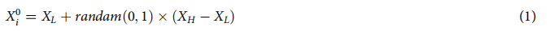

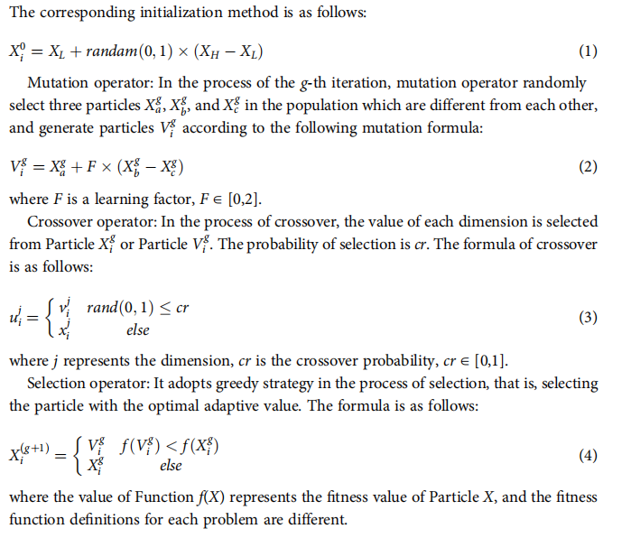

### DE算法的流程。

根据等式初始化种群(1)，并初始化DE算法的参数。步骤2。根据适应度函数计算总体中每个粒子的适应度值。步骤3。在每次迭代中，根据等式对粒子进行突变操作(2)或其他突变操作符产生突变粒子。步骤4。检查算法是否达到终止条件。如果是，算法被终止。否则，请返回到步骤2，并更新相关参数。

## xsmt_MODDE算法

###  编码方案

属性1。边缘点对的编码策略适用于DDE算法，可以很好地记录XSMT的结构。

假设引脚图中有n个引脚点，相应的Steiner树有n-1条边和n-1个PS点。对每个引脚进行编号，通过记录两个端点来确定一条边，并添加一位来记录边的选择方法。最后在末尾增加一位来表示粒子的适应度值，最终编码长度为3n  1-1。表1中引脚对应的Steiner树如图3所示，对应的编码为:1 3 1 2 3 0 4 5 0 3 4 3 46.284。

### 适应度函数

属性2。XSMT的线长是影响全局布线结果的关键因素，基于XSMT的线长的适应度值可以使算法最大限度地朝着最优线长的方向发展。

在XSMT的边集合中，所有的边都属于以下四种类型之一：水平、垂直、45°对角线和135°对角线。逆时针旋转45°对角线45°形成垂直线，逆时针旋转135°对角线45°形成水平线，这样四种类型的边可以被两种类型取代。使所有的边的起点数都小于终点数，然后根据起点数对所有的边进行排序，然后减去这些边的重叠部分。此时，可以得到XSMT的总线长度。

XSMT的卓越性取决于总导线长度。导线长度越小，XSMT的卓越性就越高。因此，用XSMT-MoDDE测量的适应度值为粒子的总线长。XSMT-MoDDE的适应度函数见等式 (5).

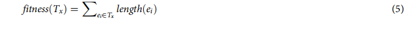

###  Initialization

属性3。Prim算法可以搜索一个边子集，它不仅包括一个连通图中的所有顶点，而且还可以使子集中所有边的权值之和最小化。选择不同的起点可以得到相同的权重，但有不同的边缘子集。采用Prim算法对种群进行初始化，使种群中的粒子具有多样性，同时可以减小解空间。

传统的DE算法直接使用等式(1)来初始化填充。但是，对于XSMT，如果使用随机策略来初始化每个粒子（即随机选择一个点作为根，并使用回溯的方法来随机选择边来构建一个合法的树），就会导致解空间太大而不能很好地收敛的问题。因此，本文利用Prim算法构造最小生成树（MST）对总体进行初始化。MST中每条边的权重由每两个引脚之间的曼哈顿距离决定。每个粒子随机选择一个起点来生成一个MST，并为MST的每个边随机选择一个连接方法。

相关伪代码如算法1所示，其中T为MST的边集，s为起点，U为MST的点集，V为pin集，P为种群，N为种群大小。第1–18行是生成MST的函数。第2–3行随机选择一个起点s并将其添加到集合U中。第4行初始化边集合t。第6行从集合U中选择一个访问过的点I，第7行将最小成本设置为无穷大。第8–13行从点I的相邻点中选择一个未访问的点j，具有最小成本的边ij将被选择并添加到集合T，点j被标记为已访问并添加到集合U。当集合U与集合V相同时，MST算法结束，第17行返回一个随机生成的MST。第21–24行构建了种群，初始粒子是由函数PRIMALGORITHM生成的MST。

### 精英选择和克隆策略

属性4。该策略提出了两种基于集合的粒子突变策略，可以在很短的时间内对精英粒子进行突变。对精英粒子进行克隆和突变，并基于贪婪策略选择最优粒子，在短时间内构建出高质量的精英缓冲区。

###  Brief description

精英选择和克隆策略包括四个步骤：选择、克隆、突变和灭绝。选择种群中的部分粒子作为精英粒子，然后克隆精英粒子形成克隆种群。克隆的粒子随机突变成突变的粒子。根据消光策略，选择突变粒子进入精英缓冲液。精英缓冲区与种群大小相同，并参与了DE的后续过程。精英选择和克隆策略可以有效地扩大DDE的搜索范围，提高算法的全局搜索能力，在一定程度上避免陷入局部峰值，防止算法过早收敛。

### 算法流程

(1)选择：根据适应度值对群体进行排序，选择前n个粒子形成精英群体，n个k×=.k为精英比率，经实验验证选择k为0.2，得到最佳结果。

(2)克隆：克隆精英群体中的粒子，克隆形成一个克隆群体c。克隆粒子的数量根据等式计算 (6).

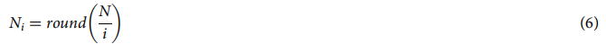

其中i是粒子在原始总体中的秩，圆的（）是四舍五入的函数。

(3)突变：突变策略采用连接法突变或拓扑突变，其中两种策略如图4所示。图4A显示了连接方法的突变过程。线路AB的连接方法从选择3更改为选择0。图4b显示了拓扑结构的突变过程。选择线路AB断开，然后连接到线路BC。每个克隆的粒子都被分配到一个突变策略来形成一个突变的粒子。

对于采用连接方法的粒子，随机选择一条边，并根据边数确定a的值，如等式所示(7)，其中n是引脚的数量。然后，更改所选边的连接方法。

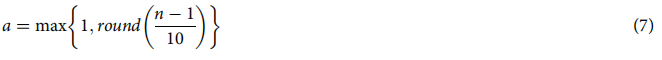

对于采用拓扑突变的粒子，在XSMT中随机断开一条边形成两个子XSMT，然后分别从两个子XSMT中分别选择一个点进行连接。该过程采用不相交集联合（DSU）的思想，以确保突变后获得合法的树。

(4)灭绝：在突变群体中选择适合度值最佳的试验精英粒子mbest。如果f mbestðÞ优于f gbestðÞ，则将mbest加入到精英缓冲液中，其他所有粒子都会死亡，否则，突变种群中的所有粒子都会死亡。如果精英缓冲区已满，适应度值最差的粒子将被打开，新的粒子将被推送。

精英选择和克隆策略的伪代码如算法2所示，其中S代表精英种群，M代表突变种群，输入为种群P及其大小，输出E代表精英缓冲区。第1-9行是选择函数，第2行计算精英粒子数n，第3行初始化集合S，第4行根据总体粒子的适应度值建立最小堆，第5-6行依次从最小堆的顶部取n个精英粒子。

第11-28行是克隆、突变和灭绝的过程。第12行初始化集合E，第14行初始化集合M，第15-20行是克隆和突变过程，第15行克隆精英粒子，第16行随机选择突变策略，第20行将突变的精英粒子添加到集合M。第22-23行通过设置P和集合M构造两个最小堆。第24行比较两个最小堆的顶部，以确定试验精英粒子是保存还是死亡。

### 新型多重突变策略

属性5。本文提出了三种新的突变策略，并引入了集合运算的思想。在合理计算时间的前提下，通过调整当前粒子的边集和其他粒子的边集，对XSMT中的一些子结构进行了改变，以寻找更好的子结构组合

在DE算法中，有六种常用的突变策略（Epitropakis et al.，2011），每种策略使用不同的基向量和微分向量。突变公式如下图所示。

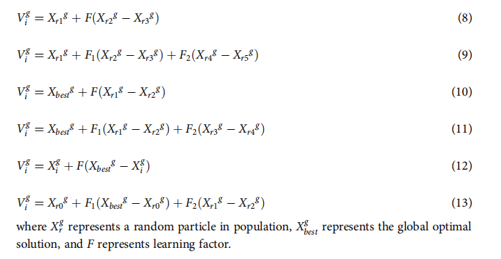

### 两个操作规则

在XSMT-MoDDE算法中，粒子表示XSMT。上述突变公式中的加减运算不能直接用于离散问题。本文定义了两种新的计算方法（定义6-7）。A是粒子X1的边集，B是粒子X2的边集，全集是A∪B。有以下两个定义：

定义6AB。表示为A和B的对称差值，即（A∪B）−（A∩B），如图5a所示。

定义7AB。首先计算集合C，C = A−B，然后将集合B的边加到集合C中，直到集合C形成合法树，如图5B所示。

### 三种突变策略

在突变策略1中，选择基向量作为当前粒子，有两个微分向量。第一阶段的微分向量由当前粒子与相应的局部历史最优粒子之间的差值生成，粒子T由等式得到 (14).第二阶段的微分向量由粒子T与全局最优粒子的差值生成，目标突变粒子Vi g由等式得到 (15).

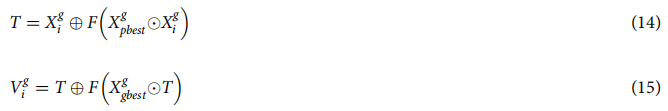

在突变策略2中，基向量仍然是当前的粒子，有两个微分向量。第一阶段的微分向量由随机粒子与相应的局部历史最优粒子之间的差值生成，粒子T由等式计算 (16).第二阶段的微分向量由随机粒子与全局最优粒子之间的差值生成，目标突变粒子Vi g由等式得到 (17).

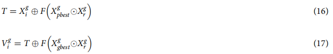

在突变策略3中，基向量为当前粒子，微分向量由种群中当前粒子与随机粒子的差值生成，突变粒子Vi g由等式得到 (18).

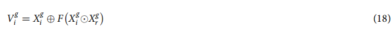

突变策略1可以使粒子获得全局最优粒子的部分结构和历史局部最优粒子，并继承两个最优粒子的特征，这是一种贪婪策略。突变策略3的实现可以扩展搜索空间，使突变方向完全摆脱了最优粒子的结构，适合于迭代的早期阶段，提高了算法的探索能力。突变策略2的探索能力是在突变策略1和突变策略3之间。

在多突变策略中，通过设置阈值将迭代过程分为两个阶段。早期以等等概率选择三种突变策略，后期取消突变策略3。多重突变策略的伪码如算法3所示，其中P表示种群，N表示种群的大小，m表示迭代次数，t表示阈值，V表示突变种群。第5行判断当前的迭代是否处于迭代的早期阶段。如果是处于迭代的早期阶段，则采用突变策略1、突变策略2和突变策略3。第6行确定当前的迭代是否处于迭代的后期阶段。如果是在后期阶段，则采用突变策略1和突变策略2。

### 适应性学习因子

属性6。学习因素是决定DDE算法性能的关键参数，它对算法的开发和探索能力具有决定性的影响。本文首次提出了一种基于集运算的自适应学习因子，以有效地平衡XSMT-MoDDE算法的搜索能力。

### 学习因素的操作规则

如等式中所示(2)，学习因子F作用于差分向量，控制DDE算法的全局搜索能力（Wang et al.，2014；Gong等人，2010；Brest等人，2006）。在离散问题中，不能使用简单的乘法运算。本文重新定义了等式中的*操作 (2).

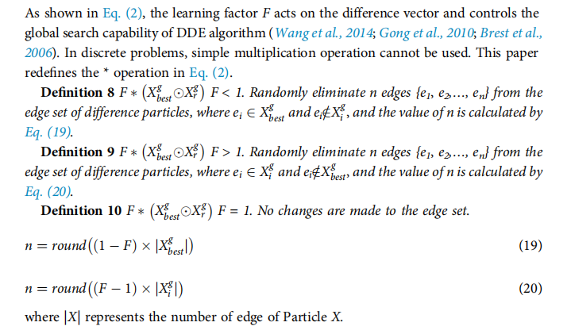

### 自适应更新过程

每个粒子Xi对应于自适应学习因子Fi，其初始化为1。每次选择操作后，参数Fi将被更新。(1)计算参考参数r，rkfbest+1，其中k为0.001，fbest为全局最优粒子的适应度值；(2)计算Xg i的适应度值fi与Xbest g的适应度值的差值δ；(3)更新Fi，更新公式如下： Fi¼Fiþ0：05 D > r Fi0：05 Dr（21）当适应度值足够接近时，降低Fi以更大程度上保持其结构，否则，增加Fi以扩大全局搜索能力

### 精炼策略

属性7。细化策略在确定的拓扑结构下，在合理的时间内最小化XSMT的导线长度。

在迭代结束时，最优粒子仍有优化的空间。为了寻找更好的结果，提出了一种改进策略。算法步骤如下：

(1)计算最优粒子中各点的度。度定义为与点相连的边数，记作di；

(2)x体系结构中有4种边。如果点的pi度为di，则有4种对应的子结构。点pi对应的所有子结构的集合为S，当确定点p1−pi−1对应的子结构时，得到边集E。计算集合S中的子结构si和集合E之间的公共线长度l，选择与最大的l对应的子结构si，并将si的边加到集合E中。算法结束，直到访问了所有的点。

细化策略算法的伪代码如算法4所示，其中X代表XSMT-MoDDE算法得到的目标粒子，n代表XSMT的点数，R代表细化粒子。第2行初始化集合r。第3-20行搜索对应于每个点的最优子结构。第4行计算点pi的次数，第5行初始化最大公共线长度，第6行初始化最优子结构集。第7–14行计算公共导线长度并更新最大公共导线长度。第15–19行将最优子结构中的边存储到集合r中。

### 相关参数

本文算法的主要参数包括种群大小n、迭代次数m、阈值t、学习因子F和交叉概率cr。

在该算法中，n为50，m为500，t为0.4。学习因子F的自适应策略已在第3.6节中详细描述。交叉概率cr也采用了自适应策略，具体如下：

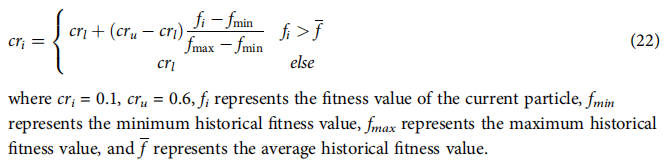

XSMT-MoDDE的算法流程

XSMT-MoDDE的算法流程图如图6所示，具体流程如下：1。初始化阈值、种群大小、自适应学习因子F和自适应交叉概率cr。 2.使用Prim算法构造初始粒子并生成初始总体。 3.检查当前阶段：迭代的早期阶段或后期阶段。 4.根据当前阶段，从相应的突变策略池中选择一个突变策略。根据突变策略获得突变粒子。 5.根据交叉算子获得试验粒子。 6.根据选择运算符获得下一代粒子。 7.采用精英选择和克隆策略，经过选择、克隆、突变、灭绝四个步骤后，更新精英缓冲区。 8.通过方程式更新自适应学习因子和自适应交叉概率。（21）和（22）。 9.检查迭代次数，如果满足终止条件，则结束迭代，否则，返回到步骤(3)。 10.在XSMT-MoDDE算法的最后，采用细化策略得到目标解。

## XSMT-MoDDE算法的复杂性分析

性质8。当总体大小为m，引脚数为n时，一次迭代的时间复杂度为O（mnlogn）。

### 多重突变算符的复杂度分析

突变过程分为两个阶段。首先构造差分向量，然后利用差分向量和基向量构造试验粒子。差分向量的构造：根据边起点的个数对两个边集的边进行排序，并利用二值搜索来构造非公共边。该过程的复杂度为O（nlog(n)），非公共边集为差分向量。突变粒子构造：根据上述相似思想构造基向量和差向量的差集。然后将差分集中的边存储在DSU中，从差分向量中随机选择边，并添加到DSU中，直到构造出一个完整的树。此过程的时间复杂度为O（nlog(n)）。

### 精英选择与克隆策略的复杂性分析

根据粒子的适应度值建立一个最小的堆，每次都选择堆的顶部进行克隆。此过程所需的时间复杂度为O (n)。突变过程采用连接法突变和拓扑突变。

连接方法变异从边集中随机选择两条不同的边来修改边的连接方法。所需的时间复杂度为O(1)。在拓扑突变中，随机断开一条边以形成两个子XSMTs，使用DSU记录这两个子XSMTs。用DSU构造两个子xsm需要O(nlog(n))时间，从两个子xsm中随机选择一个点建立连接，这个过程需要O(1)时间。通过精英选择和克隆策略获得的粒子需要存储在一个大小为m的精英缓冲液中。种群粒子和精英缓冲液粒子共同参与突变、交叉和选择操作。

### 精炼策略的复杂性分析

点i的度被记录为di。我们总是将di保持在4以内，即使有一个最小的概率大于4，在细化策略中也只考虑4条连通边。点的相邻边分别选择连接方法形成子结构。一个≤结构边缘有四种选择方法，所以一个点对应4≤子结构，其中4≤256。细化策略求出XSMT-MoDDE算法构造的最优粒子，枚举粒子各点的子结构，得到公共线长最大的子结构。所以对于n个点的情况，所需的时间是Pn i¼1 di 4di.

##  试验结果

提出的XSMT-MoDDE已经在CPU为3.5 GHz Intel的窗口计算机上用C++语言实现。为了公平地比较实验结果，我们在相同的实验环境中运行所有程序，并使用来自GEO和IBM的相同基准测试。所有启发式算法的总体大小和迭代大小分别设置为50和500。优化速率的计算公式见等式 (23).

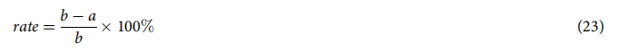

其中a为XSMT-MoDDE算法的实验结果，b为其他算法的实验结果

### 验证了多策略优化的有效性

实验1：为了验证多策略优化DDE算法在构建XSMT中的有效性，本实验将对XSMTMoDDE算法与XSMT-DDE算法的结果进行了比较。实验结果如表2和表3所示。表2为线长的优化结果，表3为标准差的优化结果。结果表明，多策略优化可实现平均线长优化率2.35%，标准差优化率95.69%。本实验证明，多策略优化对降低线长有很大的影响，同时也大大提高了DDE的稳定性。

### 验证细化策略的有效性

实验二:为了验证细化策略的有效性，本实验将比较细化XSMT-MoDDE算法和XSMT-MoDDE算法的结果。实验结果如表4和表5所示。表4是线长的优化结果，表5是标准差的优化结果。结果表明，细化策略可以获得0.50%的平均线长优化率和37.30%的标准差优化率。从实验结果和上面的复杂度分析可以看出，XSMT-MoDDE算法结束后，提炼策略只需要很短的时间就可以获得大量的线长和标准差的优化。无论是否加入精炼策略，两者在少于10个管脚的电路中总能获得精确解。精炼策略在较大的电路中具有更显著的优化效果。

### 算法比较实验

实验3:为了比较XSMT-MoDDE算法与其他启发式算法的性能，我们比较了由MoDDE算法、DDE算法、人工蜂群(ABC)算法和遗传算法(GA)构造的XSMT的结果。实验结果如表6、7和8所示。XSMT-MoDDE与XSMT-DDE、XSMT-ABC和XSMT-GA相比，平均线长减少了2.40%、1.74%和1.77%，最佳线长减少了1.26%、1.55%和1.77%，标准偏差减少了95.65%、33.52%和28.61%。实验结果表明，XSMT-MoDDE在导线长度和标准差指标上均优于XSMT-DE、XSMT-ABC和XSMT-GA。与其他算法相比，该算法在具有更好的线长结果的基础上，仍然具有优异的稳定性。

实验四:全局布线阶段，电路板上有上万个网，网内管脚需要互联。本文采用XSMTMoDDE算法优化全局布线的线长。本实验采用IBM提供的基准，使用XSMT-MoDDE算法、SAT算法和KNN算法构建XSMT。实验结果如表9所示。与SAT和KNN相比，XSMT-MoDDE的线长分别优化了10.05%和8.86%。实验结果表明，XSMT-MoDDE在构建多网XSMT问题时可以大大缩短布线长度，为全局布线提供有效指导。

最后，为了更好地理解XSMT-MoDDE算法的结果，我们使用Matlab来模拟最终的XSMT图。我们选择表7中的电路11和电路12作为代表，如图所示。7a和7b。

##  CONCLUSIONS

本文设计了四种优化策略。采用前三种优化策略加强DDE算法，采用第四种优化策略最大限度地减少最终粒子的线长。

精英选择和克隆策略扩大了搜索范围，增强了种群颗粒的多样性。对精英粒子进行克隆和突变，并贪婪地选择最优秀的粒子。这种策略使算法能够快速收敛到一个更好的状态。新的多突变策略引入了集合操作的思想。通过边缘集之间的相互作用，改变了XSMT对应的形状。三种突变策略具有不同的开发和探索能力，并且这三种策略交替使用，以避免算法过早地收敛到局部峰值。自适应学习因子动态调整并保留当前粒子边缘集与最优粒子边缘集之间的比例。有效提高全局开发和局部开发能力，寻求随机策略和贪婪策略之间的平衡。

本文提出的XSMT-MoDDE算法采用平均导线长度、最佳导线长度和标准差三个指标对算法结果进行了评价。与其他算法相比，该算法取得了更好的优化效果。此外，XSMT-MoDDE在大规模电路中具有较强的优化能力。在多网络的情况下，它优于SAT和KNN算法的结果。因此，XSMT-MoDDE算法在全局布线阶段具有良好的应用前景。今后，我们将研究利用多策略优化DDE构建避障XSMT。